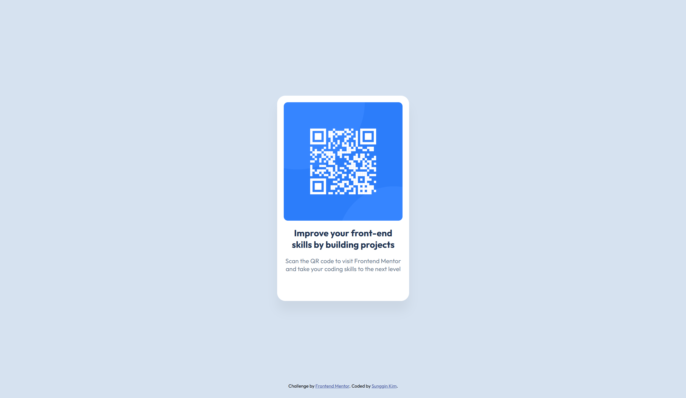

# Frontend Mentor - QR code component

## Table of contents

- [Overview](#overview)
  - [Screenshot](#screenshot)
  - [Links](#links)
- [My process](#my-process)
  - [Built with](#built-with)
- [Author](#author)

## Overview

### Screenshot

### Links

- Live Site URL: [QR code component](https://sungginkim.github.io/qr-code-component/)

## My process

### Built with

- Semantic HTML5 markup
- CSS custom properties
- Flexbox
- CSS Grid

## Author

- Frontend Mentor - [@SungginKim](https://www.frontendmentor.io/profile/SungginKim)

- Github - [@SungginKim](https://github.com/SungginKim)
